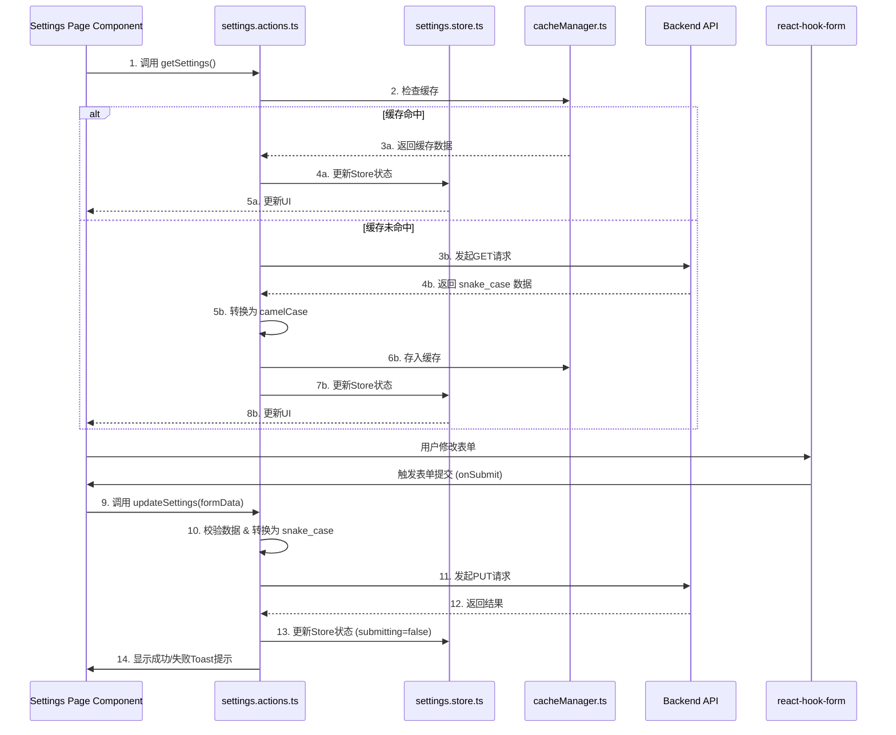

# 系统设置页面开发计划 (V1.0)

本计划旨在指导“系统设置”页面的开发工作，确保代码结构清晰、可维护性高，并完全符合项目技术和设计要求。

---

### **第一部分：文件结构规划**

**1. 新建文件:**

*   **路由页面**:
    *   `app/admin/settings/page.tsx` - 系统设置页面的主入口文件。
*   **核心组件**:
    *   `components/settings/settings-container.tsx` - 页面主容器，负责获取数据、管理Tabs状态。
    *   `components/settings/settings-form-wrapper.tsx` - 封装 `react-hook-form` 逻辑的通用表单组件。
    *   `components/settings/basic-settings-form.tsx` - “基础设置”表单。
    *   `components/settings/email-settings-form.tsx` - “邮件设置”表单。
    *   `components/settings/image-settings-form.tsx` - “图片处理”表单。
    *   `components/settings/security-settings-form.tsx` - “安全设置”表单。
    *   `components/settings/form-components.tsx` - 包含通用的表单控件，如带标签的Input、Switch等。
*   **业务逻辑与状态管理**:
    *   `lib/actions/settings.actions.ts` - 封装所有与设置相关的API请求（`getSettings`, `updateSettings`）。
    *   `lib/store/settings.store.ts` - 使用 Zustand 管理设置数据、加载和提交状态。
*   **数据模型**:
    *   `lib/types/settings.ts` - 定义所有与设置相关的TypeScript类型和Zod校验模型。
*   **样式**:
    *   `styles/setting.css` - 存放页面特定的自定义样式（如果需要）。

**2. 修改文件:**

*   `lib/constants/admin-navigation.ts` - 在导航常量中添加“系统设置”的链接定义。

---

### **第二部分：数据流与状态管理**

采用 **Component -> Action -> Store -> API** 的单向数据流模式。

**数据流转图 (Mermaid Sequence Diagram):**



*   **Zustand (`settings.store.ts`)**: 作为全局状态管理器，存储从API获取的四类设置数据、页面加载状态 (`isLoading`) 和表单提交状态 (`isSubmitting`)。
*   **React Hook Form & Zod**: 用于处理每个标签页内的表单。Zod Schema 定义在 `lib/types/settings.ts` 中，用于客户端校验。

---

### **第三部分：组件架构**

**组件层级图 (Mermaid Graph Diagram):**

```mermaid
graph TD
    A[app/admin/settings/page.tsx] --> B(SettingsContainer)
    B --> C{Tabs (shadcn/ui)}
    B --> D(ShimmerButton '保存设置')

    subgraph Tabs
        C --> C1(Tab: 基础设置)
        C --> C2(Tab: 邮件设置)
        C --> C3(Tab: 图片处理)
        C --> C4(Tab: 安全设置)
    end

    subgraph Form Content
        C1 --> F1(BasicSettingsForm)
        C2 --> F2(EmailSettingsForm)
        C3 --> F3(ImageSettingsForm)
        C4 --> F4(SecuritySettingsForm)
    end
    
    F1 & F2 & F3 & F4 --> G(SettingsFormWrapper)
    G --> H[Card (shadcn/ui)]
    H --> I(Form Components)

    subgraph Reusable Form Components
        I --> I1(Input with Label)
        I --> I2(Switch with Label)
        I --> I3(Select with Label)
        I --> I4(Textarea with Label)
    end
```

---

### **第四部分：分步实施策略**

1.  **环境搭建 (Setup & Scaffolding)**
    *   创建上述所有新文件和目录结构。
    *   在 `lib/types/settings.ts` 中，根据 `swagger.json` 的 `definitions` 部分，为 `BasicSiteSetting`, `EmailSettings`, `ImageProcessingSetting`, `SecuritySetting` 创建对应的 TypeScript `interface` 和 `zod` schema。

2.  **数据链路构建 (API & State)**
    *   在 `lib/actions/settings.actions.ts` 中，创建 `getSettings` 和 `updateSettings` 函数。
    *   在 `lib/store/settings.store.ts` 中创建 Zustand Store。

3.  **核心UI开发 (Component Implementation)**
    *   在 `app/admin/settings/page.tsx` 中，引入 `SettingsContainer`。
    *   在 `SettingsContainer` 中，实现 `Tabs` 布局和数据获取。
    *   开发 `SettingsFormWrapper`，封装 `react-hook-form`。
    *   分别开发四个核心表单组件，使用 `Card` 和 `shadcn/ui` 控件构建界面。
        *   **水印位置**: 使用 `Select` 组件，提供九宫格选项。
        *   **水印文件**: 使用 `Input` 组件。

4.  **集成与交互 (Integration & Interactivity)**
    *   关联表单与 `react-hook-form` 和 `zod` schema。
    *   连接 `onSubmit` 到 `updateSettings` action。
    *   使用 `framer-motion` 和 `magic-ui` 添加动画效果。

5.  **系统整合与收尾 (Finalization)**
    *   在 `lib/constants/admin-navigation.ts` 中添加导航链接。
    *   确保路由受 `ProtectedRoute` 保护。
    *   进行全面的响应式和深色模式测试。