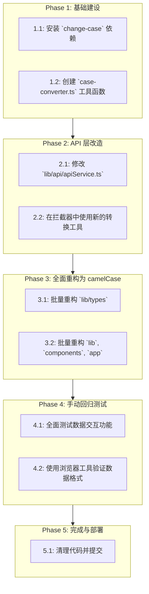

# 前后端数据结构统一作战计划 (V4 - 最终版)

## 1. 计划总览

我们将采用适配器模式，核心工具为 `change-case`，并通过一个自定义的辅助函数来实现对整个数据对象的深度转换。重构阶段将利用 IDE 的批量处理能力以提高效率。

---

## 2. 详细执行步骤

### Phase 1: 基础建设

*   **任务 1.1: 安装 `change-case` 依赖**
    *   **操作**: 在终端中运行命令 `pnpm add change-case`。

*   **任务 1.2: 创建 `case-converter.ts` 工具函数**
    *   **操作**: 在 `lib/utils/` 目录下创建 `case-converter.ts`，并实现 `deepConvertToCamelCase` 和 `deepConvertToSnakeCase` 两个递归转换函数。

### Phase 2: API 层改造 (The Adapter)

*   **任务 2.1: 修改 `lib/api/apiService.ts`**
    *   **操作**: 在 Axios 的请求和响应拦截器中，分别使用 `deepConvertToSnakeCase` 和 `deepConvertToCamelCase` 函数来自动转换数据。

### Phase 3: 全面重构为 `camelCase` (The Great Refactor)

*   **核心策略**: 使用 VS Code 的**全局查找和替换**功能，分批次、有针对性地对 `snake_case` 属性进行重构。

*   **任务 3.1: 批量重构类型定义 (`lib/types`)**
    *   **操作**:
        1.  在 `lib/types` 目录下，针对常见的 `snake_case` 属性执行“查找和替换”。
            *   **查找**: `role_id` -> **替换**: `roleId`
            *   **查找**: `created_at` -> **替换**: `createdAt`
            *   ...依此类推。
        2.  完成替换后，删除所有不再需要的 `Backend*` 类型和转换函数。
    *   **目的**: 快速、准确地统一类型定义。

*   **任务 3.2: 批量重构全项目 (`lib`, `components`, `app`)**
    *   **操作**:
        1.  以一个 `snake_case` 属性为例，例如 `last_login_at`。
        2.  在整个项目中执行全局查找 `last_login_at`。
        3.  使用“全部替换”功能，将其一次性更新为 `lastLoginAt`。
        4.  对代码库中所有其他 `snake_case` 属性重复此过程。
    *   **目的**: 通过批量操作，高效地消除整个前端代码库中的命名不一致问题。

### Phase 4: 手动回归测试 (Validation)

*   **操作**: 按照预定义的测试清单，系统性地测试所有相关功能，并使用浏览器开发者工具进行验证。