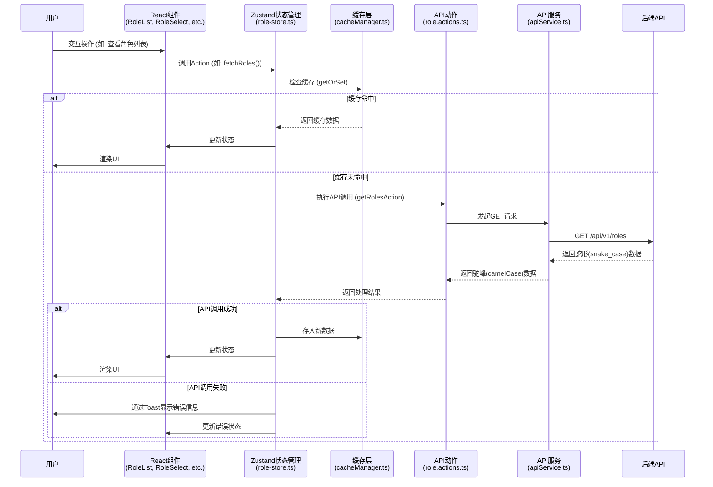

# 角色管理功能全面重构计划

本计划旨在通过四个阶段，全面提升角色管理模块的性能、可维护性和用户体验。

## 核心目标

1.  **高效数据交互**：引入缓存机制，减少不必要的API请求。
2.  **优化用户体验**：在UI上优先展示用户友好的角色别名（`alias`），同时保证与后端交互时使用角色代码（`name`/`id`）。
3.  **健壮的错误处理**：提供即时、清晰的用户错误反馈。
4.  **代码整洁性**：移除废弃的模拟数据代码，保持代码库的清晰。

## 计划总览 (Mermaid 图)

## 详细实施步骤

---

### **阶段一：数据层强化 (状态管理与缓存)**

**目标**：优化 `role-store.ts`，集成缓存和统一的Toast通知。

1.  **集成 `cacheManager`**
    *   **文件**: `lib/store/role-store.ts`
    *   **任务**: 修改 `fetchRoles`, `fetchRoleById`, 和 `fetchPermissions` 函数，使用 `cacheManager.getOrSet` 方法来包装API调用。
    *   **缓存策略**: 使用 `memory` 存储，TTL设置为5分钟。

2.  **实现缓存失效机制**
    *   **文件**: `lib/store/role-store.ts`
    *   **任务**: 在创建、更新或删除角色/权限后，调用 `cacheManager.invalidate()` 清除相关缓存。

3.  **统一用户反馈**
    *   **文件**: `lib/store/role-store.ts`
    *   **任务**: 在所有与API交互的action中，使用 `showToast` 提供成功或失败的反馈。

---

### **阶段二：API与类型校准**

**目标**：确保前端的类型定义和API调用逻辑与 `swagger.json` 完全一致。

1.  **校验 `lib/types/roles.ts`**
    *   **文件**: `lib/types/roles.ts`
    *   **任务**: 再次确认 `Role` 和 `Permission` 接口的所有字段都与 `swagger.json` 中的DTO定义完全对应。

2.  **校验 `lib/actions/roles/role.actions.ts`**
    *   **文件**: `lib/actions/roles/role.actions.ts`
    *   **任务**: 逐一核对每个action函数的请求路径、HTTP方法、请求体/参数结构。

---

### **阶段三：UI体验优化 (显示角色别名)**

**目标**：修改相关组件，UI上优先展示角色别名（`alias`），而不是角色代码（`name`）。

1.  **修改 `role-select.tsx`**: `components/shared/role-select.tsx`
    *   **任务**: 调整下拉选项和选中项的显示文本为 `role.alias || role.name`。

2.  **修改 `role-list.tsx`**: `components/admin/roles/role-list.tsx`
    *   **任务**: 更新角色卡片的标题为 `role.alias || role.name`。

3.  **修改 `role-permissions.tsx`**: `components/admin/roles/role-permissions.tsx`
    *   **任务**: 更新权限管理对话框的标题，显示角色的别名。

---

### **阶段四：代码库清理**

**目标**：移除项目中已废弃的角色管理模拟代码。

1.  **删除模拟数据文件**
    *   **文件**: `lib/mock/role-data.ts` 和 `lib/api/roles.mock.ts`
    *   **任务**: 确认无任何地方导入后，安全地删除这两个文件。

---

## 验收标准

1.  角色和权限数据在首次加载后被缓存，后续访问相同页面无新的API请求（在TTL有效期内）。
2.  在UI（如下拉框、列表、标题）中，优先展示角色的别名。
3.  所有增、删、改操作后，相关缓存自动失效，UI数据自动刷新。
4.  任何API操作失败时，屏幕右下角会弹出清晰的错误提示Toast。
5.  项目中不再存在 `role-data.ts` 和 `roles.mock.ts` 文件。